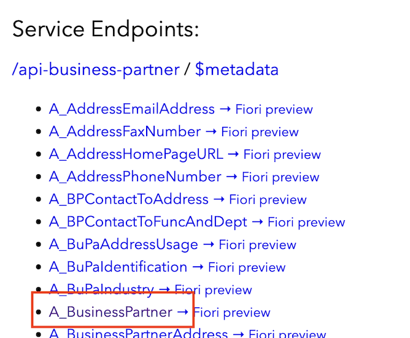

## Test with Mocked Services

First, add some test data.

Kill `cds watch`, and in the terminal, create a file `srv/external/data/API_BUSINESS_PARTNER-A_BusinessPartner.csv` like so:

```
mkdir -p srv/external/data
touch srv/external/data/API_BUSINESS_PARTNER-A_BusinessPartner.csv
```

with this content:

```csvs
BusinessPartner;BusinessPartnerFullName
Z100001;Harry Potter
Z100002;Sherlock Holmes
Z100003;Sunny Sunshine
```

Run `cds watch` again and check its ouput. You find the information about what's going on:

```
...
> init from ./srv/external/data/API_BUSINESS_PARTNER-A_BusinessPartner.csv
...
[cds] - serving IncidentsService { path: '/incidents' }
[cds] - mocking API_BUSINESS_PARTNER { at: '/api-business-partner' }
```

You see that

- The external `API_BUSINESS_PARTNER` is mocked, i.e. served in the application although in production it would come from remote. This is because we haven't specified yet how to connect it to a real remote data source.
- The CSV file with the mock data got deployed.

> `cds watch` runs in a 'mock mode' by default.  In production, this won't happen, as the application is started with `cds run`.  See the [documentation](https://cap.cloud.sap/docs/guides/extensibility/composition#testing-locally) for how `cds watch` binds to services.

Go to the home page of the application (the one listing all the service endpoints).  You can now see the `/api-business-partner` service with all its entities under _Service Endpoints_.



Data is available at `/api-business-partner/A_BusinessPartner`.

## Test with Separate Processes

There is also a possibility to run mocks in separate, but still local processes. We don't use it here in this tutorial, so check out the [documentation](https://cap.cloud.sap/docs/guides/using-services#mock-remote-service-as-odata-service-nodejs) for more.

## Summary

In the [next exercise](3.-Delegating-Requests.md), you will now connect the external service with the rest of the application's data model.
