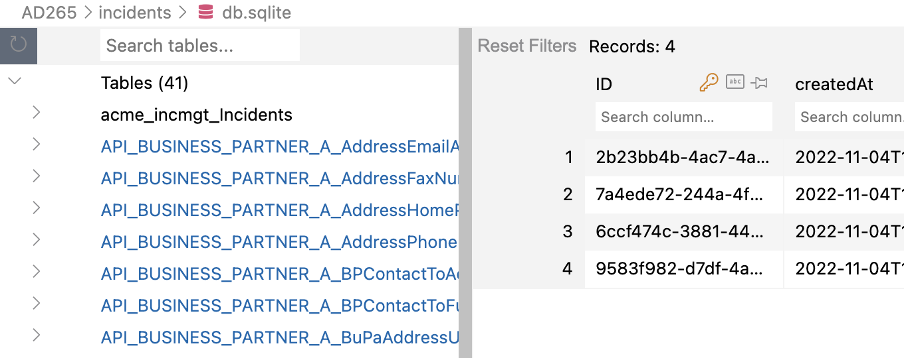
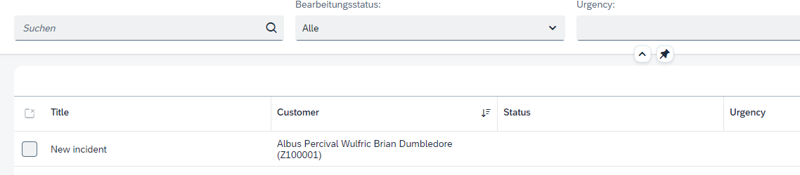

## Enable Replication for `Customers`

In the incidents list now only the customer ID is shown. The application shall display (remote) customer name together with (application-local) incident data.
This raises a **performance issue**: when showing potentially hundreds of incidents, shall the app reach out to the remote system at all?  Or just for single records, for all records at once, or for a chunk of records?

We use a different approach by **replicating remote data on demand**.

The scenario will look like this:
- The user enters a new incident and selects the customer through a value help.  This value help shows only _remote_ customer data.
- As soon as the incident record is created, the customer data is written to a local replica table.
- Further requests for the incident's customer are served from this replica table.
- Replicated records will be updated if a remote customer changes.

Start by **adding a persistent table** for the replicas.  This can be done with just one line in `srv/mashup.cds`:

```cds
annotate s4.simple.Customers with @cds.persistence: { table,skip:false };
```

The annotation `@cds.persistence: {table,skip:false}` turns the view above into a table with the same signature (`ID` and `name` columns).  See the [documentation](https://cap.cloud.sap/docs/cds/annotations#persistence) for more on annotations that influence persistence.

## Replicate Data On Demand

Now there is code needed to replicate the customer record whenever an incident is created.
In file `srv/incidents-service.js`, add this code in method _init_ before the _return_ statement:

```js
    this.db = await cds.connect.to('db')                                 // our primary database
    this.Customers = this.db.entities('s4.simple').Customers             // CDS definition of the Customers entity
    this.Incidents = this.db.entities('sap.capire.incidents').Incidents  // CDS definition of the Incidents entity
    this.on(['CREATE', 'UPDATE', 'DELETE'], 'Incidents', (req, next) => this.onCustomerCache(req, next))
```

And this snippet before the closing bracket of the class:
```js
  async onCustomerCache(req, next){
    /*
      Cleanup Cache:
      - Delete old customer ID from Cache, if changed by update or if deleted
        Only if no other incident exists
      - Insert/Update new customer ID into Cache, if changed by update or if inserted
    */    
    const newCustomerId = req.data.customer_ID
    let oldCustomerId;
    if (req.event!=="CREATE") {
      const incident = await SELECT.from(this.Incidents, req.data.ID)
      //Remember Customer ID
      oldCustomerId = incident?.customer_ID
    }
    
    const result = await next();
    
    if ( (oldCustomerId && (oldCustomerId!=="")) && ((req.event=="DELETE") || ((req.event=="UPDATE") && (oldCustomerId!==newCustomerId))) ) {
      console.log('>> DELETING customer if no more used - Incident ID: ' + req.data.ID)
      const customerIncident = await SELECT.one.from(this.Incidents).where({ customer_ID: oldCustomerId, ID:{'!=':req.data.ID} })
      if (!customerIncident) {
        //No more incidents for that Customer => delete cached record
        await DELETE.from(this.Customers).where({ ID: oldCustomerId })
      }
    }
    
    if (newCustomerId && (newCustomerId!=="") && ((req.event=="CREATE") || (req.event=="UPDATE")) ) {
      console.log('>> CREATE or UPDATE customer!')
      const customer = await this.S4bupa.read(this.Customers, newCustomerId)
      if (customer) {
        await UPSERT.into(this.Customers).entries(customer)
      }
    }
    
    return result;
  }
```

To display the customer name together with the customer ID, add this coding at the end of `mashup.cds`
```
// for an incident's customer, show both name and ID
annotate IncidentsService.Incidents:customer with @Common: {
    Text: customer.name,
    TextArrangement: #TextFirst
};
```


Now create an incident in the UI.  Don't forget to select a customer through the value help.<br>
In the log, you can see the `>> CREATE or UPDATE customer!` line, confirming that replication happens.

## Test without UI

With the [REST client for VS Code](https://marketplace.visualstudio.com/items?itemName=humao.rest-client), you can conveniently test the same flow without the UI.

Create a file `tests.http` and this content:

```
###
# @name IncidentsCreate

POST http://localhost:4004/incidents/Incidents
Content-Type: application/json

{
  "title": "New incident",
  "customer_ID": "Z100001"
}

###
@id = {{IncidentsCreate.response.body.$.ID}}

POST http://localhost:4004/incidents/Incidents(ID={{id}},IsActiveEntity=false)/draftActivate
Content-Type: application/json
```

- Click `Send Request` above the `POST .../Incidents` line. This will create the record in a draft tate.
- Click `Send Request` above the `POST .../draftActivate` line. This corresponds to the `Save` ction in the UI.

  > This second request is needed for all changes to entities managed by [SAP Fiori's draft](https://cap.cloud.sap/docs/advanced/fiori#draft-support) mechanism.

You should see the same `>> CREATE or UPDATE customer!` server log.


## Event-based Replication

We haven't discussed yet how to _update_ the cache table holding the `Customers` data.  We'll use _events_ to inform our application whenever the remote BusinessPartner has changed.  Let's see what you need to do.

## Add Events to Imported APIs

First, as synchronous and asynchronous APIs from SAP S/4HANA sources are not comprised in the imported API definition (the edmx file), we have to **add event defintitions** manually.  For the business partner model, the event information can be found at https://api.sap.com/event/CE_BUSINESSPARTNEREVENTS/resource

In file `srv/external/index.cds`, add this:

```cds
extend service S4 {
  event BusinessPartner.Changed @(topic: 'sap.s4.beh.businesspartner.v1.BusinessPartner.Changed.v1') {
    BusinessPartner: S4.A_BusinessPartner:BusinessPartner;
  }
}
```

This allows [CAP's support for events and messaging](https://cap.cloud.sap/docs/guides/messaging) to kick in, which automatically _subscribes_ to message brokers and _emits_ events behind the scenes.

Also, the event name `BusinessPartner.Changed` is semantically closer to the domain and easier to read than the underlying technical event `sap.s4.beh.businesspartner.v1.BusinessPartner.Changed.v1`.

## React to Events

So, the piece to close the loop is code to **consume events** in the application.

In `srv/incidents-service.js` add this snippet in method _init_ before the _return_ statement:
```js
  this.S4bupa.on('BusinessPartner.Changed', ({ event, data }) => this.onBusinessPartnerChanged(event, data))
```

And this snippet before the closing bracket of the class:
```js
  async onBusinessPartnerChanged(event, data){
    console.log('<< received', event, data)
    const { BusinessPartner: ID } = data
    const customer = await this.S4bupa.read (this.Customers, ID)
    let exists = await this.db.exists (this.Customers,ID)
    if (exists)
      await UPDATE (this.Customers, ID) .with (customer)
    else
      await INSERT.into (this.Customers) .entries (customer)
  }
```

## Emitting Events from Mocked Services

But who is the **event emitter**?  Usually it's the remote data source, i.e. the SAP S4/HANA system.  For local runs, it would be great if something could **emit events when testing**. Luckily, you can add a simple event emitter in a new file `srv/external/API_BUSINESS_PARTNER.js`:

```js
module.exports = function () {
  const { A_BusinessPartner } = this.entities;

  this.after('UPDATE', A_BusinessPartner, async data => {
    const event = { BusinessPartner: data.BusinessPartner }
    console.log('>> BusinessPartner.Changed', event)
    await this.emit('BusinessPartner.Changed', event);
  })
}
```

This means whenever you change data through the `API_BUSINESS_PARTNER` mock service, a local event is emitted.
Also note how the event name `BusinessPartner.Changed` matches to the event definition from the CDS code above.

## Put it all together

Before starting the application again, it's time to turn the current in-memory database into a persistent one.  This way, data is not reset after each restart, which is useful if you added data manually.

So, kill `cds watch`, then execute:
```
cds deploy --with-mocks --to sqlite
```

To use this persistent database, add its URL in `package.json` file the cds/db section:
```
"cds": {
  "requires": {
    ...
      "db": {
        "kind": "sql",
        "[development]": {
          "credentials": {
            "url": "db.sqlite"
          }
        }
      }
    ...
```

Start the application with mocks:

```
cds watch
```

The application runs as before.  In the log, however, you no longer see a database deployment, but a line like:
```
...
[cds] - connect to db > sqlite { url: 'db.sqlite' }
...
```

> This also means that after changes to the data model (new fields, entities etc.), you need to execute the `cds deploy ...` command again.  Keep this in mind in case you see errors like _table/view not found_.

<!-- You might also want to open the `db.sqlite` file and inspect the contents of the database:
 -->

In your file `tests.http`, first execute the 2 requests to **create an incident** again (see [section above](#test-without-ui)).

Now **change customer** `Z100001` with an HTTP request. Add this request:

```
###
PUT http://localhost:4004/api-business-partner/A_BusinessPartner/Z100001
Authorization: Basic carol:
Content-Type: application/json

{
  "BusinessPartnerFullName": "Albus Percival Wulfric Brian Dumbledore"
}
```

After clicking `Send Request` above the `PUT ...` line, you should see both the event being emitted as well as received:

```
>> BusinessPartner.Changed { BusinessPartner: 'Z100001' }
<< received BusinessPartner.Changed { BusinessPartner: 'Z100001' }
```

The UI also reflects the changed data:



> Note that we can't test the event roundtrip in the `cds watch --profile sandbox` mode, as the sandbox system of SAP Business Accelerator Hub does not support modifications.  You would need to use a dedicated SAP S/4HANA system here.  See this [tutorial](https://developers.sap.com/tutorials/btp-app-ext-service-s4hc-register.html) for how to register your own SAP S/4HANA system.


## Summary
Congratulations! You have finished the exercises!
In the [summary](5.-Summary.md), you will see the summary of what you have done.
